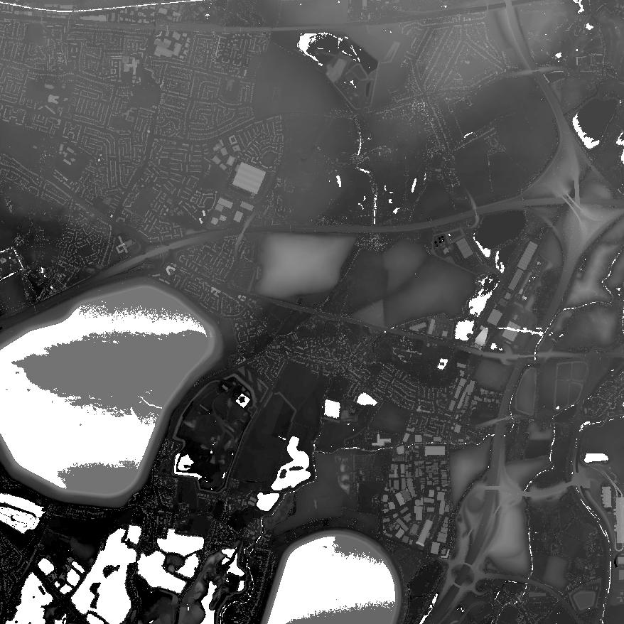
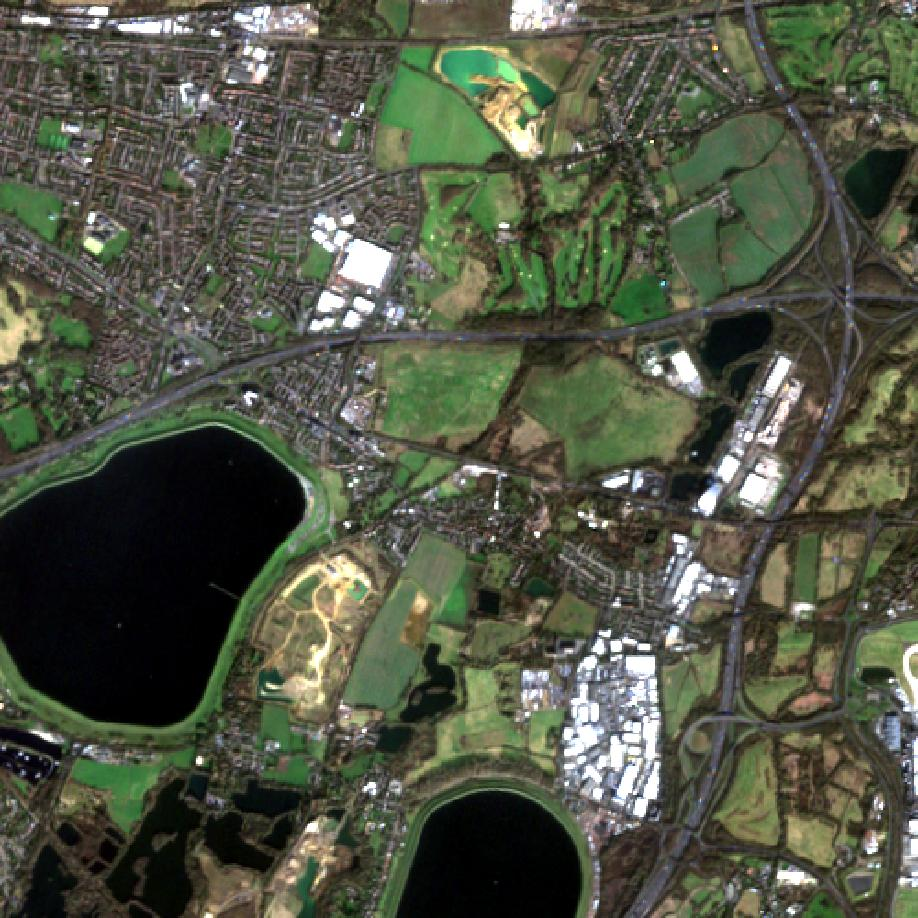

# Introduction
This program was created over 48 hours, starting during a Hackathon. I learnt a lot during this process, and I want to document this. Not just for myself, but also because if anyone else somehow stumbles across this repository then it might be useful. 

It takes a high-res 1 band, 8-bit LIDAR image and a low-res 4 band (BGRNir) satellite image, and uses a pansharpening function from the gdal library to combine the two. 

Data sources:
Lidar data (https://environment.data.gov.uk/survey) 
Satellite data (https://browser.dataspace.copernicus.eu/)

# Why?
LIDAR measures depth and therefore doesn't collect any colour data. However, it can also be to a high resolution (the example in this repo is 1mx1m). On the other hand, colour images might have lower resolution (the example in this repo is 10mx10m). By combining the two, you can end up with a 1mx1m image that preserves the colour data.

Example (LIDAR, BGRNir, pansharpened image):

  
  
  

# Tools
You can use QGIS to visualise the tif images, however the program does also generate a jpg version. The colour images were 16-bit (ie. each pixel could have colour values 0-65535 instead of the typical 0-255) which, unlike QGIS, most photo editors don't seem to cope with. QGIS was also an easy way to check that the geodata was still accurate at the end of the program. 

You'll need a few libraries installed, the most annoying of which is gdal. I'd recommend using conda to install it, there's documentation for using pip but there's a decent chance it'll fail. 

# How?
WIP

# Problems
I'm done with this project, but there are a few issues with it that I'd be working on if I wanted to continue.

Dealing with the water was pretty difficult. The LIDAR was not particularly accurate for large bodies of water, with sudden changes from high to low depths. As mentioned above, this was dealt with using a mask, but the edges of the mask are often a bit wobbly and because it just uses a simple threshold it sometimes marks non-water pixels as water. I'd like a better, more accurate way of dealing with this.

The program currently expects 8-bit for the LIDAR, 16-bit for the BGRNir. I haven't tried it with an 8-bit BGRNir image and I don't know if that's something you'd even come across in the real world, but I'm pretty sure the program would break if you tried it. It'd be an easy fix however, to add 8-bit handling. 

Some of the LIDAR pixels were negative, which I did not deal with. From the images generated, it's clear there weren't many, but I'd still want to deal with them by replacing them with average values from their surroundings. I'm not entirely sure how the pansharpening library dealt with them, but clearly it did. I think they might be the cause of certain off colours or black 'tears'.

The hillshading parameters are manually adjustable, but I think the time the lidar data was taken is included in its meta data. If it is, then I would be able to use this to generate accurate values for the location of the sun, to improve the realism of the final render.
